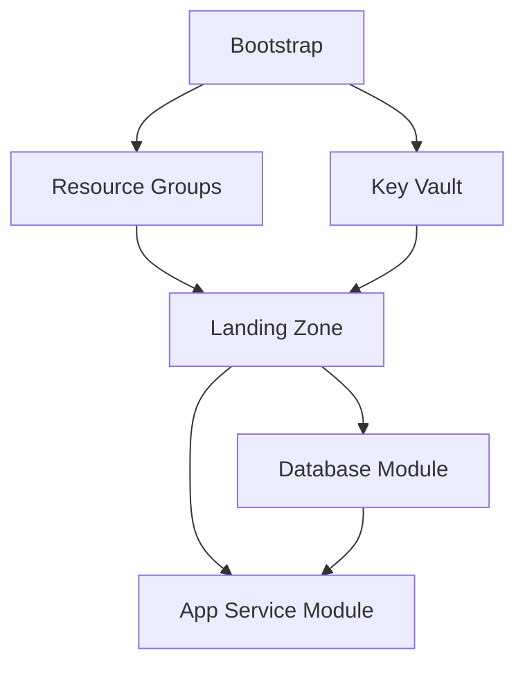

# System Patterns - WeatherAPI Demo

## Architecture Overview

### High-Level Architecture

```
┌─────────────────────────────────────────────────────────────────┐
│                      GitHub Repository                          │
├─────────────────────────────────────────────────────────────────┤
│  ┌─────────────────┐  ┌─────────────────┐  ┌─────────────────┐  │
│  │   Source Code   │  │   Terraform     │  │ GitHub Actions  │  │
│  │   (.NET API)    │  │   (IaC)         │  │   (CI/CD)       │  │
│  └─────────────────┘  └─────────────────┘  └─────────────────┘  │
└─────────────────────────────────────────────────────────────────┘
                                │
                                ▼
┌─────────────────────────────────────────────────────────────────┐
│                      Azure Subscription                         │
├─────────────────────────────────────────────────────────────────┤
│  ┌─────────────────┐  ┌─────────────────┐  ┌─────────────────┐  │
│  │   Bootstrap     │  │   Development   │  │   Staging/Prod  │  │
│  │   Resources     │  │   Environment   │  │   Environments  │  │
│  │  - Resource RGs │  │  - App Service  │  │   (Future)      │  │
│  │  - Key Vault    │  │  - SQL Database │  │                 │  │
│  │  - Shared Svcs  │  │  - Networking   │  │                 │  │
│  └─────────────────┘  └─────────────────┘  └─────────────────┘  │
└─────────────────────────────────────────────────────────────────┘
```

## Key Design Patterns

### 1. Bootstrap Pattern

**Purpose**: Separate foundational infrastructure from application environments

**Implementation**:

- **Bootstrap Environment**: Creates resource groups, shared Key Vault, and foundational services
- **Application Environments**: Reference bootstrap outputs via Terraform remote state
- **State Separation**: Different Terraform state files for different concerns

**Benefits**:

- Clean separation of concerns
- Shared services across environments
- Safe environment-specific deployments

### 2. Resource Group Organization

**Pattern**: Environment and purpose-based resource group strategy

```
weatherapi-demo-terraform-state-rg  # Terraform state storage
weatherapi-demo-app-rg              # Shared application resources
weatherapi-demo-dev-rg              # Development environment
weatherapi-demo-staging-rg          # Staging environment
weatherapi-demo-prod-rg             # Production environment
```

**Benefits**:

- Clear resource ownership
- Easy cost tracking
- Simplified cleanup
- Environment isolation

### 3. Terraform State Management

**Pattern**: Remote state with environment separation

**Structure**:

```
Azure Storage Container: tfstate
├── bootstrap/terraform.tfstate      # Bootstrap infrastructure
├── dev/terraform.tfstate           # Development environment
├── staging/terraform.tfstate       # Staging environment (future)
└── prod/terraform.tfstate          # Production environment (future)
```

**Benefits**:

- Team collaboration
- State consistency
- Environment isolation
- Backup and versioning

### 4. Security Architecture

#### Service Principal Pattern

```
Service Principal (weatherapi-demo-github-actions-sp)
├── Contributor Role (Subscription Level)
├── Storage Blob Data Contributor (State Storage)
├── User Access Administrator (Resource Management)
└── Key Vault Administrator (Secrets Management)
```

#### Secrets Management Pattern

```
Azure Key Vault (Shared)
├── Application Secrets
├── Database Connection Strings
└── External API Keys

GitHub Repository Secrets
├── Azure Authentication (SP credentials)
├── Terraform Backend Configuration
└── Deployment Configuration
```

### 5. Network Architecture

**Pattern**: Hub-spoke networking with environment isolation

```
Virtual Network (10.0.0.0/16)
├── App Subnet (10.0.1.0/24)        # Application tier
├── Database Subnet (10.0.2.0/24)   # Database tier
└── Management Subnet (future)       # Management/monitoring
```

**Security Controls**:

- Network Security Groups per subnet
- Service endpoints for Azure services
- Private endpoints for sensitive services
- VNet integration for App Service

## Component Relationships

### Terraform Module Dependencies



### Data Flow Patterns

```
GitHub Actions → Azure Service Principal → Resource Groups
                                       → Key Vault
                                       → Terraform State Storage

Terraform → Bootstrap State → Dev Environment Configuration
                           → Shared Key Vault Access
                           → Resource Group References
```

## Design Decisions

### 1. Terraform-First Approach

**Decision**: Use Terraform for all infrastructure except bootstrap storage
**Rationale**:

- Infrastructure as Code best practices
- Version control and change tracking
- Declarative configuration
- Team collaboration support

**Trade-offs**:

- ✅ Consistent, repeatable deployments
- ✅ Version-controlled infrastructure
- ❌ Initial complexity for simple demos
- ❌ Terraform state management overhead

### 2. Shared Key Vault Pattern

**Decision**: Single Key Vault shared across environments
**Rationale**:

- Simplified demo setup
- Centralized secrets management
- Cost optimization for demo scenarios

**Trade-offs**:

- ✅ Simplified access management
- ✅ Cost-effective for demos
- ❌ Less isolation than production patterns
- ❌ Potential security boundaries in real environments

### 3. Automated GitHub Secrets

**Decision**: Use GitHub CLI for automated secret management
**Rationale**:

- Eliminates manual configuration
- Ensures consistency
- Improves demo reliability

**Trade-offs**:

- ✅ Fully automated setup
- ✅ No manual errors
- ❌ Requires GitHub CLI installation
- ❌ Additional tooling dependency

### 4. Subscription Flexibility

**Decision**: Support multiple Azure subscriptions with automatic detection
**Rationale**:

- Demo environment flexibility
- Personal vs. corporate subscription options
- Graceful fallback handling

**Implementation**:

```bash
# Test primary subscription
if az account set --subscription "${PRIMARY_SUB}" 2>/dev/null; then
    use_primary_subscription
else
    fallback_to_secondary_subscription
fi
```

## Deployment Patterns

### 1. Progressive Deployment

**Pattern**: Bootstrap → Environment → Application

**Stages**:

1. **Bootstrap**: Foundational resources and shared services
2. **Environment**: Environment-specific infrastructure
3. **Application**: Application deployment and configuration

### 2. Environment Promotion

**Pattern**: Dev → Staging → Production

**Configuration**:

- Terraform workspaces or separate directories
- Environment-specific variable files
- Graduated security and compliance requirements

### 3. Blue-Green Deployment

**Pattern**: App Service deployment slots

**Implementation**:

- Production slot for live traffic
- Staging slot for new deployments
- Slot swap for zero-downtime deployments

## Monitoring and Observability

### Application Insights Integration

```
Application → App Service → Application Insights → Log Analytics
                        → Custom Metrics
                        → Performance Monitoring
                        → Error Tracking
```

### Infrastructure Monitoring

```
Azure Resources → Azure Monitor → Log Analytics → Alerts (future)
                             → Metrics
                             → Diagnostic Logs
```

## Scalability Patterns

### Horizontal Scaling

- App Service Plan scaling rules
- Database DTU/vCore scaling
- Storage account performance tiers

### Multi-Environment Scaling

- Additional Terraform environments
- Environment-specific configurations
- Shared vs. isolated resources

## Security Patterns

### Identity and Access Management

- Service Principal with minimal permissions
- Azure AD integration for SQL Database
- Key Vault access policies

### Network Security

- NSG rules for subnet protection
- Service endpoints for Azure services
- Private endpoints for sensitive data

### Secrets Management

- Key Vault for application secrets
- GitHub repository secrets for CI/CD
- No secrets in source code or Terraform files
